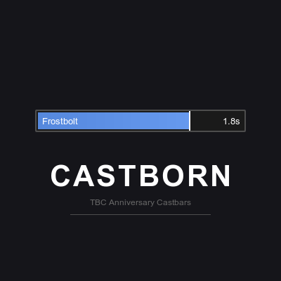
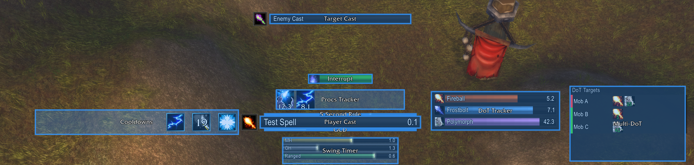
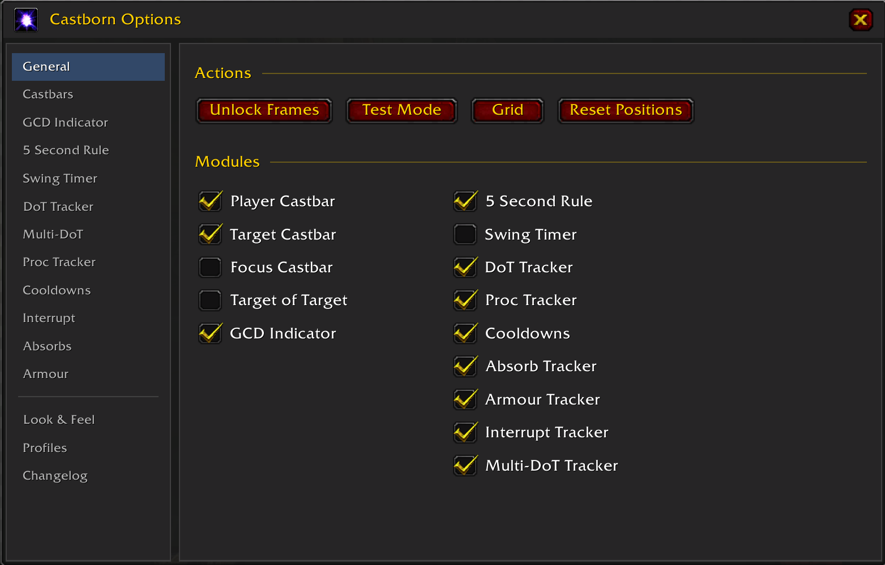

# Castborn

  

A castbar addon for World of Warcraft: The Burning Crusade Classic.

## Screenshots

  

## Features

- Player, target, focus, and target-of-target castbars
- GCD indicator
- Five Second Rule tracker (mana regeneration)
- Swing timers (melee and ranged)
- DoT tracker
- Multi-DoT tracker (track DoTs on multiple targets)*
- Cooldown tracker
- Proc tracker
- Interrupt tracker

*\*Experimental - may have issues*

## Installation

1. Download and extract to `Interface/AddOns/Castborn`
2. Restart WoW or `/reload`

## Usage

- `/cb` - Open options panel
- `/cb unlock` - Unlock frames for repositioning
- `/cb lock` - Lock frames
- `/cb test` - Show test mode
- `/cb reset` - Reset all positions

## Configuration

All frames can be repositioned by unlocking (`/cb unlock`) and dragging. The GCD indicator and Five Second Rule tracker anchor to the player castbar by default.

Colours, sizes, and module toggles are available in the options panel (`/cb`).
